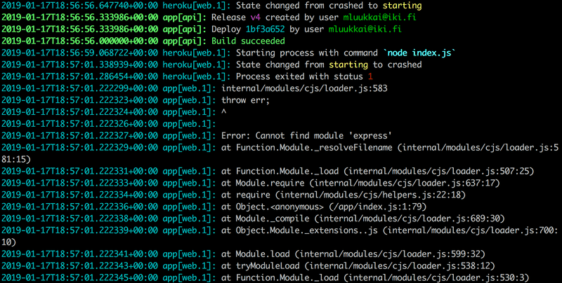
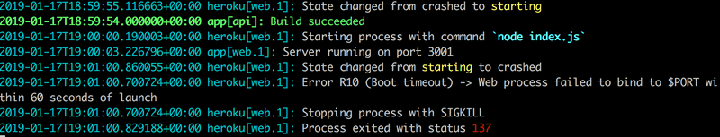

# Exercises 3.9.-3.11

The following exercises don't require many lines of code. They can however be challenging, because you must understand exactly what is happening and where, and the configurations must be just right.

## 3.9 phonebook backend step9

Make the backend work with the phonebook frontend from the exercises of the previous part. Do not implement the functionality for making changes to the phone numbers yet, that will be implemented in exercise 3.17.

You will probably have to do some small changes to the frontend, at least to the URLs for the backend. Remember to keep the developer console open in your browser. If some HTTP requests fail, you should check from the _Network-tab_ what is going on. Keep an eye on the backend's console as well. If you did not do the previous exercise, it is worth it to print the request data or request.body to the console in the event handler responsible for POST requests.

## 3.10 phonebook backend step10

Deploy the backend to the internet, for example to Heroku.

**NB** the command heroku works on the department's computers and the freshman laptops. If for some reason you cannot [install](https://devcenter.heroku.com/articles/heroku-cli) Heroku on your computer, you can use the command [npx heroku](https://www.npmjs.com/package/heroku).

Test the deployed backend with a browser and Postman or VS Code REST client to ensure it works.

**PRO TIP**: When you deploy your application to Heroku, it is worth it to at least in the beginning keep an eye on the logs of the heroku application **AT ALL TIMES** with the command `heroku logs -t`.

The following is a log of one typical problem. Heroku cannot find application dependency express:

The reason is that the _express_ package has not been installed with the `npm install express` command, so information about the dependency was not saved to the file _package.json_.

Another typical problem is that the application is not configured to use the port set to the environment variable `PORT`:

Create a **README.md** at the root of your repository, and add a link to your online application to it.

## 3.11 phonebook full stack

Generate a production build of your frontend, and add it to the internet application using the method introduced in this part.

**NB** If you use Heroku, make sure the directory _build_ is not gitignored

Also, make sure that the frontend still works locally (in development mode when started with command `npm start`).

If you have problems getting the app working make sure that your directory structure matches [the example app](https://github.com/fullstack-hy2020/part3-notes-backend/tree/part3-3).
